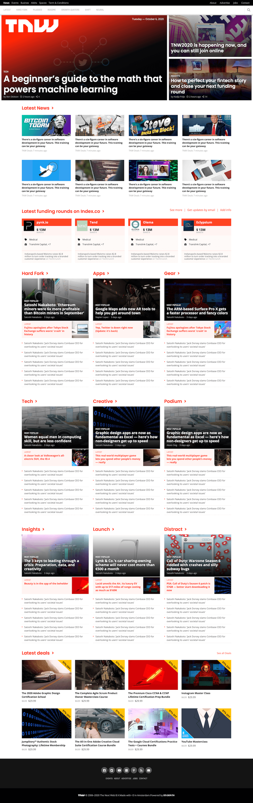

# Building With Responsive Design




## About The Project

<!-- This project consists of replicating the The Next Web website putting emphasis on how it behaves differently depending on the size of the screen where the website is rendered. -->

This project clones The [Next Web](https://thenextweb.com/), a tech-focused magazine which uses media queries to gracefully degrade their site as the window size is reduced.


## Built With

- HTML, CSS
- Fontawesome
- Javascript

## Live Demo

[Live Demo Link](https://raw.githack.com/yocosaka/building-with-responsive-design/next-web/index.html)


## Getting Started

* Clone this repo https://github.com/yocosaka/building-with-responsive-design
* To get a local copy up and running follow these simple steps.

Install dependencies:

```
npm install
```

or 

```
yarn install
```


### Prerequisites

- Npm install or yarn install is required to make new commits.


## Authors

👤 **Yoko Saka**
- GitHub: [@yocosaka](https://github.com/yocosaka)
- Twitter: [@yocosaka](https://twitter.com/yocosaka)
- LinkedIn: [LinkedIn](https://www.linkedin.com/in/yokosaka)


👤 **Lameck Otieno**
  - GitHub: [@githubhandle](https://github.com/Lameck1)
  - Twitter: [@twitterhandle](https://twitter.com/lameck721)
  - LinkedIn: [LinkedIn](https://www.linkedin.com/in/lameck-odhiambo-642b7077/)

## 🤝 Contributing

Contributions, issues, and feature requests are welcome!

Feel free to check the [issues page](https://github.com/Lameck1/Design-Teardown/issues).


## Show your support

Give a ⭐️ if you like this project!


## 📝 License

This project is [MIT](lic.url) licensed.


## Acknowledgements

* [Font Awesome](https://fontawesome.com)
* [Google Fonts](https://fonts.google.com/)
